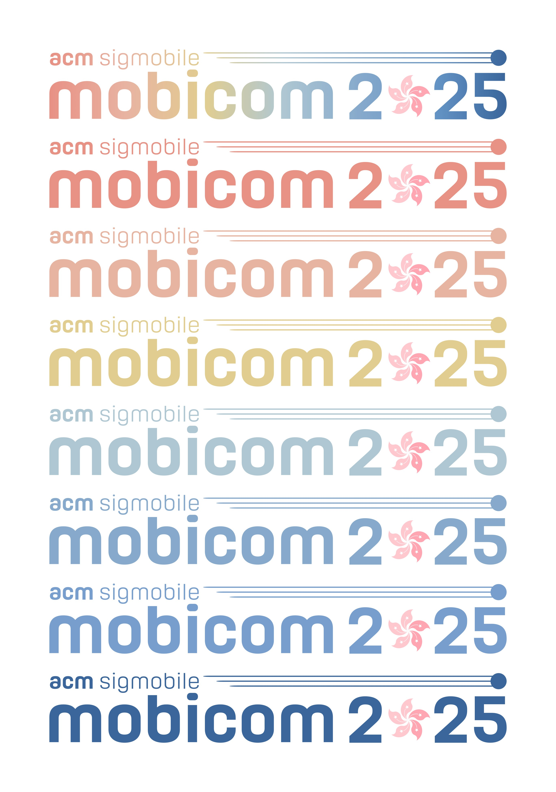

# ACM MobiCom 2025 Branding
Unofficial Branding for the 31st Annual International Conference on Mobile Computing and Networking (ACM MobiCom 2025)

# Warning & Disclaimer
All the logos and branding materials in this repo is currently unofficial, i.e., not officially recognized by the organizing committee of MobiCom 2025. Users try our design at their own risk and responsibility.

# Branding Design

# Acknowledgement
The author Changhan Ge @ UT Austin sincerely appreciates the help from ChatGPT, an LLM model owned and designed by OpenAI.

# Contact
If you have any questions regarding the this unofficial branding, please reach out to Changhan Ge at chge@utexas.edu.
